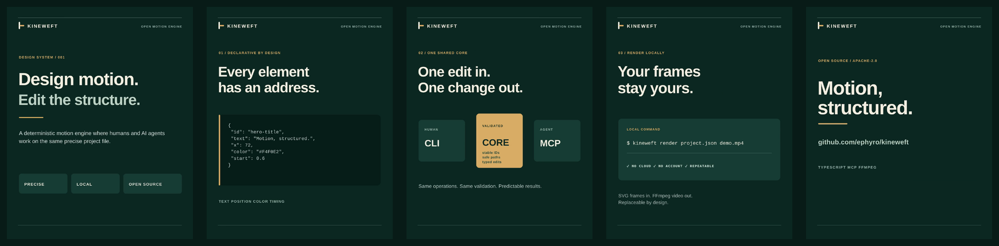

<div align="center">
  

  **Open-source motion design controlled by humans and AI agents.**

  [](https://github.com/ephyro/kineweft/actions/workflows/ci.yml)
  [](LICENSE)
</div>

Kineweft is a local TypeScript motion engine. A versioned JSON document describes a composition; the CLI and MCP server call the same validated operations to edit it and render repeatable frames. Project files never execute code.

## Demo

<div align="center">
  <a href="docs/kineweft-linkedin-demo.mp4">
    
  </a>
</div>

Watch the [13-second Kineweft demo](docs/kineweft-linkedin-demo.mp4), then inspect or edit its declarative [project source](examples/linkedin-launch.kineweft.json). The video was rendered locally by Kineweft at 1080×1350, 24 FPS, with no cloud service.

The [Qwen model guide demo](docs/qwen-open-models-sep-2026.mp4) shows version 2 scenes, shared color and font tokens, measured text placement, and contrast guards. Its [contact sheet](docs/qwen-open-models-contact-sheet.png) and [project source](examples/qwen-open-models-sep-2026.kineweft.json) are included. The model guide is an editorial example, not a live model ranking.

## Requirements

- Node.js 24 LTS or newer and npm.
- FFmpeg on `PATH` with the `libx264` encoder for MP4 video output. Audio projects also need FFmpeg's AAC encoder. Kineweft invokes the external `ffmpeg` executable and does not bundle it. Verify with `ffmpeg -hide_banner -encoders | grep -E 'libx264|aac'`.
- PNG frame rendering uses the MPL-2.0-licensed `@resvg/resvg-js` package.

The video renderer writes H.264 (`libx264`) video in an MP4 container with `yuv420p` pixels, plus AAC audio when requested. FFmpeg builds differ; Kineweft reports a clear error if FFmpeg or the encoder is unavailable. Codec patent status varies by jurisdiction. Kineweft makes no patent coverage claim.

## Setup and first render

From this directory:

```sh
npm install
npm run build
node dist/cli.js init /tmp/kineweft-demo.json
node dist/cli.js inspect /tmp/kineweft-demo.json
node dist/cli.js preview /tmp/kineweft-demo.json 2.5 /tmp/kineweft-frame.png
node dist/cli.js render /tmp/kineweft-demo.json /tmp/kineweft-demo.mp4
```

The demo source is [`examples/technical-reel.kineweft.json`](examples/technical-reel.kineweft.json), a forest-green and ivory vertical explainer. It works offline after dependencies and FFmpeg are installed. No LLM account, cloud service, or paid renderer is needed.

You can initialize from a different valid project JSON with `--example path/to/project.json`; `init` copies the file and its referenced local image/audio assets into the output directory.

## CLI editing

Use JSON files for element creation and partial updates. Example `title.json`:

```json
{
  "id": "title-card",
  "type": "text",
  "text": "A precise edit",
  "x": 80,
  "y": 240,
  "fontSize": 64,
  "fontWeight": 700,
  "letterSpacing": -1,
  "color": "#f3efdf",
  "start": 0,
  "end": 8,
  "animation": { "type": "fade", "duration": 0.6 }
}
```

```sh
node dist/cli.js add /tmp/kineweft-demo.json title.json
node dist/cli.js update /tmp/kineweft-demo.json title-card '{"x":120,"color":"#c3d1b3"}'
```

`add` accepts a JSON filename. `update` accepts either a JSON filename or an inline JSON object. (Shell quoting differs across platforms.) Existing IDs cannot be added twice, and an element's ID and type cannot be changed by update.

For version 2 projects, use `add-scene`, `add ... --scene scene-id`, `update ... --scene scene-id`, and `update-project` to edit composition settings, tokens, components, audio, or captions. `lint` reports text that does not fit its declared box, content outside the canvas, and low color contrast:

```sh
node dist/cli.js init /tmp/qwen-reel/project.json --example examples/qwen-open-models-sep-2026.kineweft.json
node dist/cli.js lint /tmp/qwen-reel/project.json
node dist/cli.js preview /tmp/qwen-reel/project.json 7.3 /tmp/qwen-frame.png
node dist/cli.js render /tmp/qwen-reel/project.json /tmp/qwen-reel.mp4
```

## MCP server

Kineweft uses the official MCP TypeScript SDK v2 and its local stdio transport. Build once, then add a server entry to an MCP client configuration. For example, in a local client config that accepts `mcpServers`:

```json
{
  "mcpServers": {
    "kineweft": {
      "command": "node",
      "args": ["/absolute/path/to/kineweft/dist/mcp.js"]
    }
  }
}
```

Restart that client after editing its config. The server exposes `create_project`, `inspect_project`, `add_element`, `update_element`, `add_scene`, `update_project`, `lint_project`, `preview_frame`, and `render_video`. Tool handlers call the same functions used by the CLI. Provide local filesystem paths visible to the server process. MCP stdio reserves stdout for protocol messages; diagnostics go to stderr.

## Project format v1

The complete schema is represented by the checked-in example. The top level contains `format: "kineweft"`, `version: 1`, `composition`, and an ordered `elements` array. Composition dimensions are pixels; duration and element `start`/`end` values are seconds. Colors use `#RRGGBB`. Element IDs are stable, unique strings. Elements render in array order, back to front.

Elements currently support:

- `text`: text, position, color, font family, size, weight, letter spacing, line height, optional width, and start/middle/end alignment.
- `rect`: position, dimensions, color, and corner radius.
- `image`: a local project-relative image path, position, dimensions, and contain/cover fit.

All elements support opacity and timing. `animation` and `exitAnimation` accept deterministic `fade` or `rise` motion, a duration in seconds, and one of `linear`, `easeInCubic`, `easeOutCubic`, or `easeInOutCubic`. A rise also fades, which avoids a hard visual pop at its first frame. Images must resolve inside the project directory, including after symlink resolution; network URLs and absolute paths are rejected. Only PNG, JPEG, WebP, and SVG image assets are intended. Font selection is delegated to the local rendering environment; the demo requests Liberation Sans and falls back according to the renderer's local font database.

## Project format v2

Version 2 keeps v1 files readable and adds optional layout and production fields. The [Qwen reel source](examples/qwen-open-models-sep-2026.kineweft.json) is a complete v2 example with Ephyro colors, reusable rules, and six overlapping scenes.

- `tokens.colors` maps names to hex colors; use `"$accent"` in any color field. `tokens.fonts` maps names to installed font family names; use `"$body"` in `fontFamily`. Unknown token references fail validation.
- `quality` can set `minTextContrast` (default 4.5:1), `minLargeTextContrast` (3:1), and `minSurfaceContrast` (1.4:1). `lint` samples text against the visible background and filled surfaces against what sits behind them. Set `enforceContrast: true` to reject edits and video renders that fail those checks. Set `enforcePalette: true` to reject colors outside `tokens.colors`. The Qwen reel enables both guards.
- Text and rectangles can declare `colorGroup`. Elements in the same group must resolve to the same color, even when their token names differ. The opening headline uses `"colorGroup": "opening-headline"`, so an edit cannot change one line's color without updating the other.
- `components` maps a name to a list of visual elements with local coordinates and times. Place one using a `component` element with `name`, `x`, `y`, `start`, and `end`. Child IDs are local to the definition; instances can move and animate independently.
- `scenes` is an optional array of `{ id, start, duration, elements }`. Each scene's element times are local to the scene, making one scene movable without retiming its children. Top-level `elements` remain available for full-video overlays.
- Text can declare `width`, `height`, `align`, `verticalAlign`, `wrap: "word"`, `fit: "shrink"`, and `minFontSize`. For vertical alignment, `x,y` is the box's top-left corner; otherwise `y` remains the text baseline for v1 compatibility. Fitting uses the local SVG font metrics. `lint` checks measured overflow and canvas bounds.
- `audio: { "src": "assets/music.wav", "volume": 0.7, "start": 0 }` adds one project-relative audio track to MP4 output. `captions` is an array of `{ id, text, start, end, color, background, fontSize }` entries rendered into both previews and video. Use explicit newlines for caption wrapping. Audio paths receive the same directory escape protection as images.

The renderer sends PNG frames directly to FFmpeg through a pipe; it no longer writes a temporary frame directory. It still rasterizes each SVG frame locally, so higher resolution and frame rates take longer.

## Dependencies and licenses

Original Kineweft code and documentation are licensed under Apache-2.0. Direct runtime dependencies are:

The Ephyro mark in the Qwen example is Ephyro branding. The Apache-2.0 code license does not grant trademark rights to that mark.

| Dependency | Purpose | License |
| --- | --- | --- |
| `@modelcontextprotocol/server` | Official MCP server SDK v2 | MIT |
| `@resvg/resvg-js` | SVG to PNG rasterization | MPL-2.0 |
| `zod` | Runtime schema validation | MIT |
| FFmpeg executable | H.264 video encoding, installed separately | FFmpeg is LGPL-2.1-or-later by default; enabling GPL components or linking GPL libraries changes the applicable obligations |

Development dependencies are TypeScript (Apache-2.0) and `@types/node` (MIT). Transitive package licenses are recorded by npm in the generated lockfile/package metadata and should be reviewed for redistributed builds. The FFmpeg project identifies `libx264` as GPL; therefore, a build that provides the requested H.264 encoder may carry GPL obligations. FFmpeg is an external system dependency, and users should inspect the license notices of their specific build before redistribution. Kineweft does not bundle FFmpeg or assert codec patent coverage.

## Current limitations

- There is no timeline UI, multitrack audio mixer, transition editor, keyframe editor, cloud service, or account system.
- Caption wrapping is manual. Color checks sample representative times and text positions; they cannot assess the content of image assets, every animation frame, or subjective color harmony. Surface contrast is a project-specific visibility threshold, not a WCAG conformance claim. The layout report does not judge overall visual balance or detect every collision.
- Text shaping, available fonts, SVG rasterization details, and FFmpeg build behavior depend on the local runtime. Frame calculations and element operations are deterministic for the same project, renderer version, fonts, and assets; this is not a promise of identical pixels across different platforms.
- Video rendering streams frames sequentially, so high-resolution compositions can still take substantial CPU time.
- V1 projects remain readable; there is no automatic rewrite or migration command.
