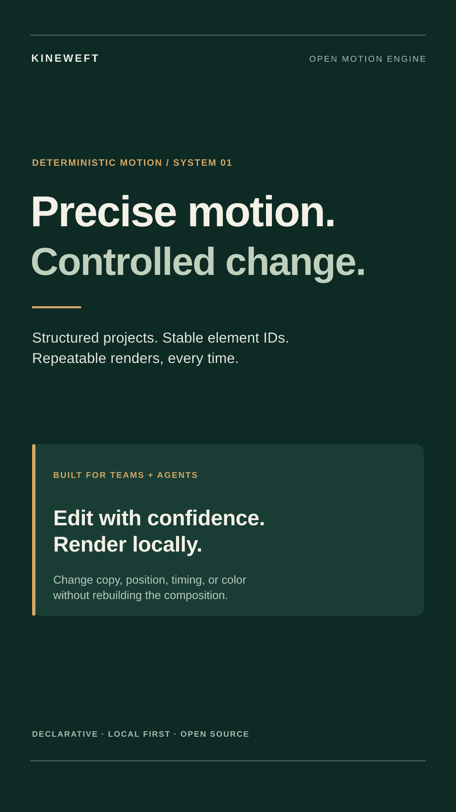

<div align="center">
  

  **Open-source motion design controlled by humans and AI agents.**

  [](https://github.com/ephyro/kineweft/actions/workflows/ci.yml)
  [](LICENSE)
</div>

Kineweft is a local TypeScript motion engine. A versioned JSON document describes a composition; the CLI and MCP server call the same validated operations to edit it and render repeatable frames. Project files never execute code.

<div align="center">
  
</div>

## Requirements

- Node.js 24 LTS or newer and npm.
- FFmpeg on `PATH` with the `libx264` encoder for MP4 video output. Kineweft invokes the external `ffmpeg` executable and does not bundle it. Verify with `ffmpeg -hide_banner -encoders | grep libx264`.
- PNG frame rendering uses the MPL-2.0-licensed `@resvg/resvg-js` package.

The video renderer writes H.264 (`libx264`) video in an MP4 container with `yuv420p` pixels. FFmpeg builds differ; Kineweft reports a clear error if FFmpeg or the encoder is unavailable. Codec patent status varies by jurisdiction. Kineweft makes no patent coverage claim.

## Setup and first render

From this directory:

```sh
npm install
npm run build
node dist/cli.js init /tmp/kineweft-demo.json
node dist/cli.js inspect /tmp/kineweft-demo.json
node dist/cli.js preview /tmp/kineweft-demo.json 2.5 /tmp/kineweft-frame.png
node dist/cli.js render /tmp/kineweft-demo.json /tmp/kineweft-demo.mp4
```

The demo source is [`examples/technical-reel.kineweft.json`](examples/technical-reel.kineweft.json), a forest-green and ivory vertical explainer. It works offline after dependencies and FFmpeg are installed. No LLM account, cloud service, or paid renderer is needed.

You can initialize an empty project by passing a different valid project JSON with `--example path/to/project.json`; `init` copies the input file to the requested output path.

## CLI editing

Use JSON files for element creation and partial updates. Example `title.json`:

```json
{
  "id": "title-card",
  "type": "text",
  "text": "A precise edit",
  "x": 80,
  "y": 240,
  "fontSize": 64,
  "fontWeight": 700,
  "letterSpacing": -1,
  "color": "#f3efdf",
  "start": 0,
  "end": 8,
  "animation": { "type": "fade", "duration": 0.6 }
}
```

```sh
node dist/cli.js add /tmp/kineweft-demo.json title.json
node dist/cli.js update /tmp/kineweft-demo.json title-card '{"x":120,"color":"#c3d1b3"}'
```

`add` accepts a JSON filename. `update` accepts either a JSON filename or an inline JSON object. (Shell quoting differs across platforms.) Existing IDs cannot be added twice, and an element's ID and type cannot be changed by update.

## MCP server

Kineweft uses the official MCP TypeScript SDK v2 and its local stdio transport. Build once, then add a server entry to an MCP client configuration. For example, in a local client config that accepts `mcpServers`:

```json
{
  "mcpServers": {
    "kineweft": {
      "command": "node",
      "args": ["/absolute/path/to/kineweft/dist/mcp.js"]
    }
  }
}
```

Restart that client after editing its config. The server exposes `create_project`, `inspect_project`, `add_element`, `update_element`, `preview_frame`, and `render_video`. Tool handlers call the same functions used by the CLI. Provide local filesystem paths visible to the server process. MCP stdio reserves stdout for protocol messages; diagnostics go to stderr.

## Project format v1

The complete schema is represented by the checked-in example. The top level contains `format: "kineweft"`, `version: 1`, `composition`, and an ordered `elements` array. Composition dimensions are pixels; duration and element `start`/`end` values are seconds. Colors use `#RRGGBB`. Element IDs are stable, unique strings. Elements render in array order, back to front.

Elements currently support:

- `text`: text, position, color, font family, size, weight, letter spacing, line height, optional width, and start/middle/end alignment.
- `rect`: position, dimensions, color, and corner radius.
- `image`: a local project-relative image path, position, dimensions, and contain/cover fit.

All elements support opacity and timing. `animation` and `exitAnimation` accept deterministic `fade` or `rise` motion, a duration in seconds, and one of `linear`, `easeInCubic`, `easeOutCubic`, or `easeInOutCubic`. A rise also fades, which avoids a hard visual pop at its first frame. Images must resolve inside the project directory, including after symlink resolution; network URLs and absolute paths are rejected. Only PNG, JPEG, WebP, and SVG image assets are intended. Font selection is delegated to the local rendering environment; the demo requests Liberation Sans and falls back according to the renderer's local font database.

## Dependencies and licenses

Original Kineweft code and documentation are licensed under Apache-2.0. Direct runtime dependencies are:

| Dependency | Purpose | License |
| --- | --- | --- |
| `@modelcontextprotocol/server` | Official MCP server SDK v2 | MIT |
| `@resvg/resvg-js` | SVG to PNG rasterization | MPL-2.0 |
| `zod` | Runtime schema validation | MIT |
| FFmpeg executable | H.264 video encoding, installed separately | FFmpeg is LGPL-2.1-or-later by default; enabling GPL components or linking GPL libraries changes the applicable obligations |

Development dependencies are TypeScript (Apache-2.0) and `@types/node` (MIT). Transitive package licenses are recorded by npm in the generated lockfile/package metadata and should be reviewed for redistributed builds. The FFmpeg project identifies `libx264` as GPL; therefore, a build that provides the requested H.264 encoder may carry GPL obligations. FFmpeg is an external system dependency, and users should inspect the license notices of their specific build before redistribution. Kineweft does not bundle FFmpeg or assert codec patent coverage.

## Current limitations

- There is no timeline UI, audio, transitions, keyframe editor, cloud service, or account system.
- Text shaping, available fonts, SVG rasterization details, and FFmpeg build behavior depend on the local runtime. Frame calculations and element operations are deterministic for the same project, renderer version, fonts, and assets; this is not a promise of identical pixels across different platforms.
- Video rendering currently creates temporary PNG frames and encodes them sequentially, so long or high-resolution compositions can use substantial disk space and time.
- The format is versioned at v1; there is no migration command yet.
